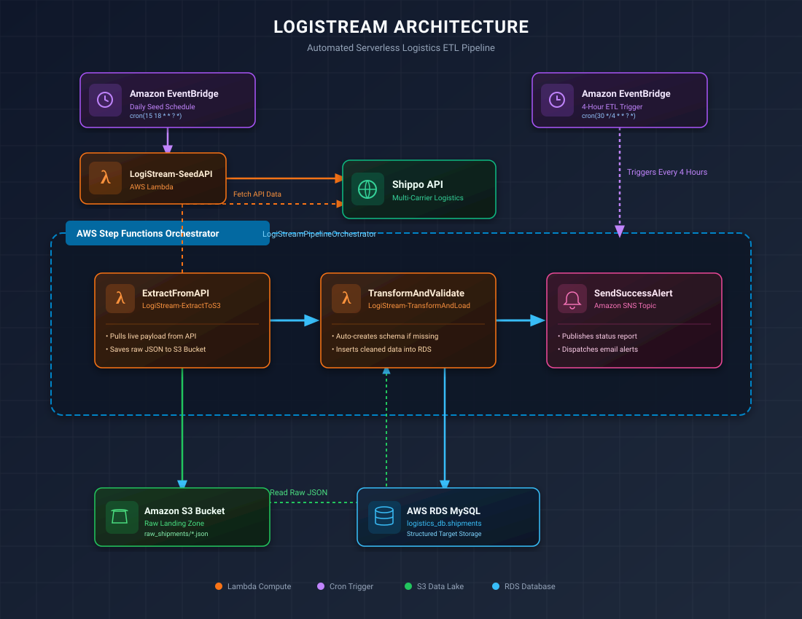
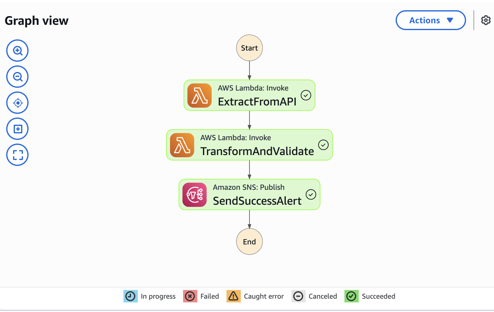
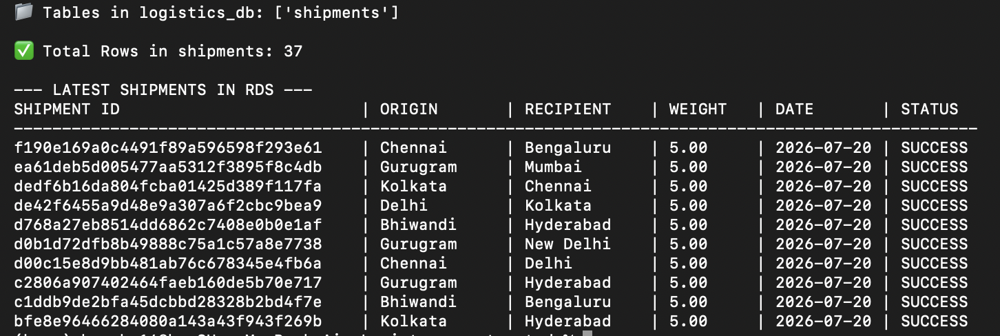
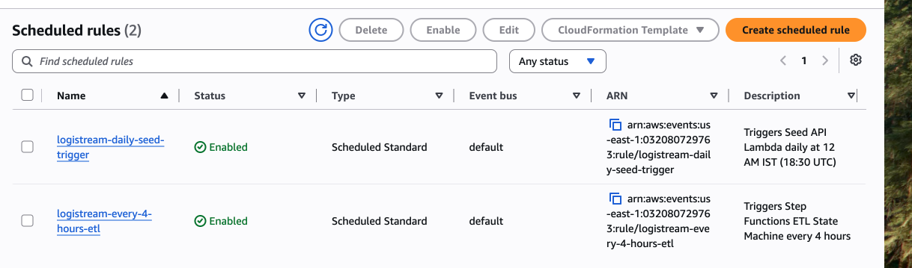
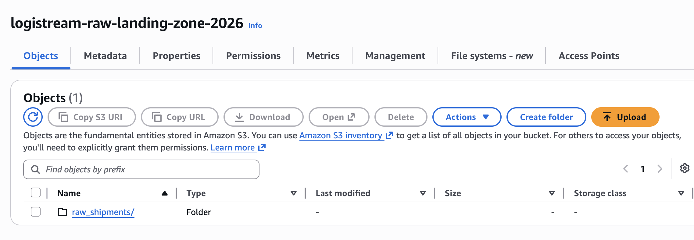

# 🚚 LogiStream: Automated Serverless Logistics ETL Pipeline

LogiStream is a production-ready, cloud-native data engineering pipeline deployed entirely via Infrastructure as Code (**Terraform**). It automates the daily extraction of third-party logistics data (Shippo API), lands raw JSON payloads into an **AWS S3** data lake, transforms and validates the record schema via **AWS Lambda**, and loads structured records into an **AWS RDS MySQL** database. Pipeline workflows are orchestrated with **AWS Step Functions**, scheduled using **Amazon EventBridge**, and monitored via **Amazon SNS**.

---

## 🏗️ System Architecture



---

## 🛠️ Tech Stack & Services

* **Infrastructure as Code (IaC):** Terraform
* **Compute / Serverless:** AWS Lambda (Python 3.11 with bundled `pymysql`)
* **Workflow Orchestration:** AWS Step Functions (`LogiStreamPipelineOrchestrator`)
* **Data Storage / Data Lake:** Amazon S3 (`logistream-raw-landing-zone-2026`)
* **Relational Database:** AWS RDS MySQL (`logistics_db`)
* **Scheduling:** Amazon EventBridge (Cron rules)
* **Alerts & Monitoring:** Amazon SNS (`logistream-pipeline-alerts`)
* **Data Source:** Shippo Multi-Carrier Logistics API

---

## 🚀 Pipeline Features

1. **Automated Seeding Engine:** An EventBridge rule (`logistream-daily-seed-trigger`) fires daily at **12:00 AM IST (18:30 UTC)** to execute `LogiStream-SeedAPI`, pushing mock shipment batches into the Shippo API.
2. **Automated 4-Hour ETL Cycle:** A recurring EventBridge rule (`logistream-every-4-hours-etl`) triggers the AWS Step Functions State Machine every 4 hours (`cron(30 */4 * * ? *)`) to pull, transform, and load incoming records.
3. **Landing Zone Architecture (ELT/ETL):** Preserves immutable raw JSON payloads in Amazon S3 prior to downstream processing.
4. **Self-Healing Relational Schema:** The transformation Lambda automatically checks table metadata in MySQL and creates schema constructs dynamically (`CREATE TABLE IF NOT EXISTS shipments`) if missing.
5. **Infrastructure Decoupling:** Fully parameterized environment variables, security group ingress rules, and IAM policies managed declaratively with Terraform.

---

## 📸 Pipeline Execution

### 1. Workflow Orchestration (AWS Step Functions)
State machine execution graph coordinating extraction, transformation/loading, and success notifications.



---

### 2. Automated Database Ingestion (AWS RDS MySQL)
Query verification proving raw API payloads are parsed and inserted into `logistics_db.shipments`.



---

### 3. Automated EventBridge Schedules
Active cloud event rules driving daily seeding and 4-hour recurring ETL runs.



---

### 4. Raw S3 Landing Zone
Storage of raw API JSON payloads before transformation.



---

## 📂 Project Structure
```
.
├── main.tf                    # Complete Terraform deployment declaration
├── lambda_src/                # Serverless Python Lambda source files
│   ├── seed_api.py            # Generates test shipment batches via Shippo API
│   ├── extract_to_s3.py       # Extracts raw API JSON and lands in S3
│   └── transform_and_load.py  # Transforms S3 payloads & loads into RDS MySQL
├── docs/
│   └── images/                # Architecture SVG and verification PNG screenshots
│       ├── architecture.svg
│       ├── step_functions_success.png
│       ├── rds_mysql_query.png
│       ├── eventbridge_schedules.png
│       └── s3_landing_zone.png
└── README.md

```
---

## ⚙️ Deployment Instructions

### Prerequisites
* [Terraform](https://www.terraform.io/) (v1.0.0+)
* [AWS CLI](https://aws.amazon.com/cli/) configured with valid account credentials
* [Python 3.11+](https://www.python.org/)

### Setup Steps

1. **Clone the Repository:**
 ```bash
git clone [https://github.com/saiharsha-14/Logistream_automated.git](https://github.com/saiharsha-14/Logistream_automated.git)
cd Logistream_automated

```
2. **Bundle Dependencies into Lambda Source:**
```bash
pip install pymysql -t lambda_src/

```

3. **Deploy Infrastructure via Terraform:**
```bash
terraform init
terraform apply --auto-approve

```

4. **Trigger Manual Orchestration Execution (Optional):**
```bash
aws stepfunctions start-execution \
  --state-machine-arn "arn:aws:states:us-east-1:032080729763:stateMachine:LogiStreamPipelineOrchestrator" \
  --region us-east-1

```

5. **Query Live RDS Database Records:**
```bash
/Applications/anaconda3/bin/python3 -c "
import pymysql
conn = pymysql.connect(
    host='logistics-db-instance.cm380e2k0m0x.us-east-1.rds.amazonaws.com',
    user='root',
    password='LogiStream2026SecurePass!',
    database='logistics_db'
)
cursor = conn.cursor()
cursor.execute('SELECT COUNT(*) FROM shipments;')
print('✅ Total Records in RDS MySQL:', cursor.fetchone()[0])
conn.close()
"
```
